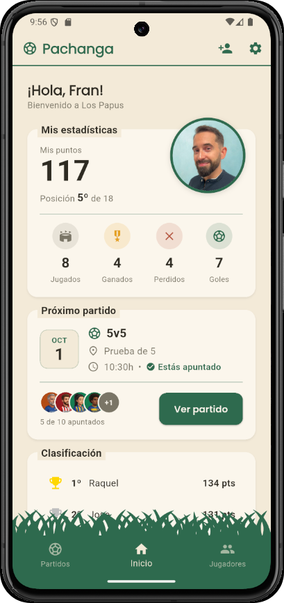
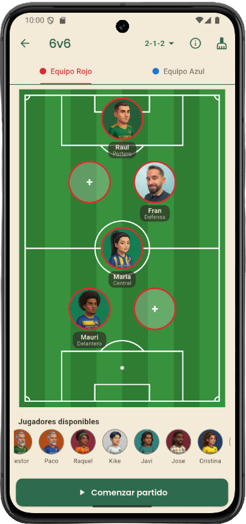
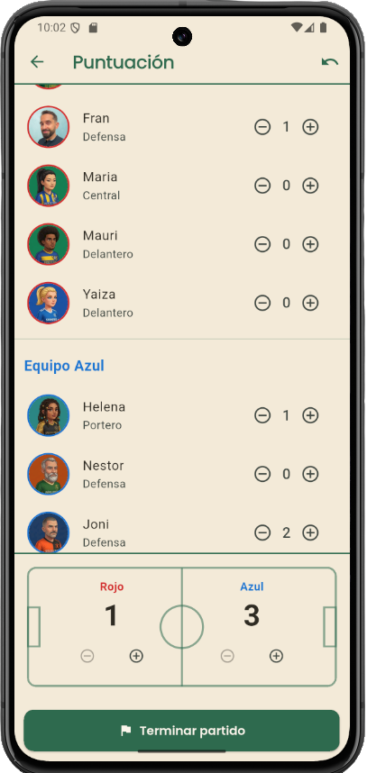
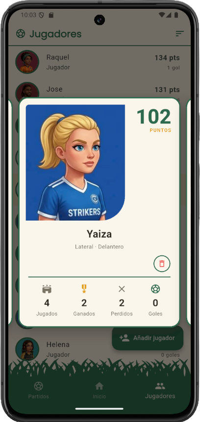
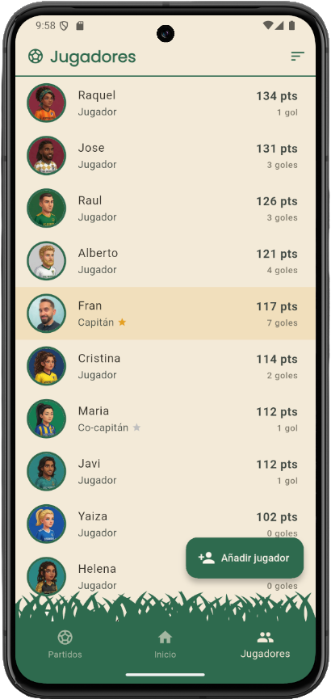

<p align="center">
  
</p>

**Pachanga** es una app móvil para organizar partidos de fútbol entre amigos: grupos privados, alineaciones de jugadores sobre el campo, puntuación en vivo y una clasificación que premia jugar en equipo. Construida con Flutter y Firebase.

> Proyecto personal desarrollado como pieza principal de mi portfolio. Nace de un problema real: el caos de organizar las pachangas semanales de mi grupo de amigos por WhatsApp.

---

## Qué hace

**⚽Grupos privados.** Cada grupo tiene un código de invitación. El creador es el capitán y puede nombrar co-capitanes para repartir la gestión. Los jugadores que no usan la app también existen: el capitán puede crear "jugadores sin cuenta" y gestionarlos como a cualquier otro.

**⚽Partidos con pizarra táctica.** El capitán crea un partido (5v5, 6v6 o 7v7), elige formación de un catálogo (1-2-1, 2-3-1, 3-1-2...) y coloca a los jugadores sobre un campo de fútbol dibujado en pantalla. Cada jugador puede ocupar su hueco y elegir posición. Al cambiar de formación, las fichas se deslizan animadas a sus nuevas posiciones, y se puede elegir entre mantener a los jugadores colocados o vaciar el equipo.

**⚽Puntuación en vivo.** Durante el partido se registran los goles de cada jugador. El marcador es editable de forma independiente (goles en propia, ajustes), así que el resultado del equipo y los goles individuales no tienen por qué coincidir. Al terminar, se calculan y reparten los puntos.

**⚽Sistema de puntos.** Cada jugador parte de una base y suma o resta según el resultado y sus goles, con un matiz: los goles valen más cuanto más defensiva es la posición (un gol del portero vale más que uno del delantero), y el portero tiene bonus por portería a cero. La filosofía es premiar el resultado colectivo por encima del lucimiento individual. Los eventos de cada partido se guardan para poder recalcular la puntuación si las reglas cambian.

**⚽Perfil y cromos.** Foto de perfil con recorte integrado, y una vista de "cromo" para cada jugador con sus estadísticas, al estilo de los álbumes de toda la vida.

## Capturas

| Inicio | Pizarra táctica | Puntuación en vivo |
| :---: | :---: | :---: |
|  |  |  |

| Cromo de jugador | Jugadores | Partidos |
| :---: | :---: | :---: |
|  |  |  |

**Cambio de formación animado:**

<p align="center">
  
</p>

**Colocar un jugador en el campo:**

<p align="center">
  
</p>

## Stack

- **Flutter** (Dart) — una sola base de código para Android e iOS.
- **Firebase** — Auth (email/contraseña), Cloud Firestore (datos), Storage (fotos de perfil).
- Paquetes destacables: `flutter_svg` (campo de juego vectorial), `image_picker` + `image_cropper` (foto de perfil con recorte), `google_fonts`.

## Decisiones de diseño

Algunas decisiones de arquitectura que definen el proyecto, y su porqué:

**⚽Estadísticas por membresía, no por usuario.** Los puntos, goles y victorias viven en la relación jugador-grupo (`Membership`), no en el usuario. Si mañana un jugador pertenece a dos grupos, sus estadísticas no se mezclan.

**⚽Jugadores sin cuenta como miembros de pleno derecho.** En un grupo real siempre hay amigos que no se instalan la app. En lugar de tratarlos como un caso aparte, son membresías normales con un flag `isGhost` y sin usuario asociado: se colocan en el campo, marcan goles y puntúan como cualquiera. Queda abierta la puerta a vincularles una cuenta real más adelante y que hereden su historial.

**⚽Formaciones como catálogo de coordenadas relativas.** Cada formación es una lista de posiciones (x, y) en el rango 0–1, independientes del tamaño de pantalla. El equipo que defiende la portería contraria reutiliza las mismas coordenadas espejadas (y' = 1 − y). Añadir una formación nueva es añadir una entrada al catálogo, sin tocar la UI.

**⚽Roles con una sola pregunta.** Capitán, co-capitán y jugador. Casi toda la app no pregunta "¿eres el capitán?" sino "¿puedes gestionar?" (`canManage`), centralizado en el modelo. Cuando apareció el rol de co-capitán, la mayoría de pantallas cambiaron una línea.

**⚽Escrituras atómicas para operaciones críticas.** Terminar un partido actualiza el partido y las estadísticas de todos los jugadores en un batch de Firestore: o se aplica todo, o no se aplica nada.

**⚽Borrado suave.** Eliminar a un jugador del grupo no reescribe la historia: los partidos ya jugados conservan su nombre y sus goles.

**⚽Eventos por partido.** Cada partido guarda sus goles y ajustes como datos propios. Las reglas de puntuación son una función sobre esos datos, así que si el grupo decide cambiar las reglas, la clasificación entera puede recalcularse.

## Estado y hoja de ruta

El proyecto está en desarrollo activo. Funciona el ciclo completo: crear grupo, invitar, programar partidos, alinear, puntuar y clasificar.

En el horizonte, aproximadamente en este orden:

- Reglas de puntuación configurables por grupo
- Fotos para jugadores sin cuenta y reglas de seguridad granulares en Firestore/Storage
- Vincular una cuenta nueva a un jugador sin cuenta (heredando su historial)
- Edición de partidos ya jugados con recálculo de puntos
- Google Sign-In, modo oscuro e internacionalización

## Sobre el proceso de desarrollo

Este proyecto está desarrollado en colaboración con IA (Claude, de Anthropic) como herramienta de pair programming y aprendizaje. El planteamiento del producto, las decisiones funcionales y la validación de cada bloque son míos; el diseño técnico y el código se han trabajado de forma conjunta, discutiendo las alternativas antes de implementar. Lo cuento abiertamente porque refleja mi forma real de trabajar: creo que saber dirigir, cuestionar y verificar el trabajo hecho con IA es hoy una competencia tan importante como escribir el código a mano.

## Ejecutar el proyecto

Requisitos: Flutter (canal stable) y un proyecto de Firebase propio.

```bash
git clone https://github.com/FranGonzalez7/pachanga.git
cd pachanga
flutter pub get
flutterfire configure   # vincula tu proyecto de Firebase
flutter run
```

---

Desarrollado por **Fran** — [LinkedIn](https://www.linkedin.com/in/frangonzalezromero/) · [GitHub](https://github.com/FranGonzalez7)